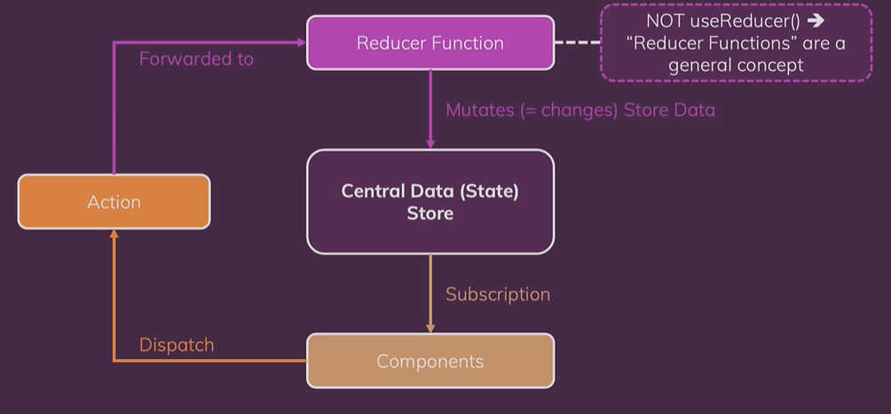

# redux

## 🟦 출처

해당 프로젝트는 udemy의 "[React 완벽 가이드 with Redux, Next.js, Typescript](https://www.udemy.com/course/best-react)" 강의를 기반으로 생성했습니다


## 🟦 Redux란?

> `크로스 컴포넌트` 또는 `앱 와이드 상태`를 위한 상태관리 시스템
>
> 우리가 상태, 즉 애플리케이션을 변경하고 화면에 표시하는 데이터를 관리하도록 도와줌


### 3가지 상태

1. **로컬 상태**
   * 데이터가 변경되어 하나의 컴포넌트에 속하는 UI에 영향을 미치는 상태
   * 사용자의 입력을 받는 상태나 토글 버튼의 상태 등
   * useState(), useReducer()을 통해 구현 가능
2. **크로스 컴포넌트 상태**
   * 다수의 컴포넌트에 영향을 미치는 상태
   * 모달컴포넌트
   * props chaining / props drilling 요구됨
3. **앱와이드 상태**
   * 애플리케이션 전체에 영향을 미치는 상태
   * 사용자 인증
   * props chainig, props drilling 요구됨


### React Context의 한계

> `Context API`도 크로스 컴포넌트 상태나 앱 와이드 상태를 쉽게 관리할 수 있도록 함
>
> 전역적으로 데이터를 관리할 수 있게 함
>
> `redux`도 이와 같은 문제를 해결해줌 


* Context API와 redux를 함께 사용할 수는 있다
* Context APi를 사용하면 설정이 복잡해지고 관리 또한 복잡해질 수 있다
* Context APi를 사용하면 심하게 중첩된 JSX 코드가 나올 수 있다
* Context API는 데이터가 자주 변경되는 경우에는 적합하지 않다
* redux는 유동적인 상태관리 라이브러리
* Context APi가 redux를 대체할 수 없다


## Redux의 작동방식

> 애플리케이션에 있는 하나의 중앙 데이터 저장소
>
> 데이터 == 상태



1. 하나의 컴포넌트가 store에 대한 구독(subscription) 을 설정

2. 컴포넌트가 저장소를 구독하고 데이터가 변경될 때마다 저장소가 컴포넌트에 알려주게 됨

3. 컴포넌트는 저장된 데이터를 직접 조작하지 않는다. 리듀서를 이용한다

4. 리듀서는 변형을 담당한다 (useReducer와는 다르다). 리듀서는 입력을 받아서 입력을 변환하고 줄이는 함수 (숫자로 된 리스트를 )

   입력을 변환해 새로운 출력, 새로운 결과를 뱉어냄

 5. 컴포넌트에서 트리거로 버튼을 누르거나 한다면 액션을 발송

    액션은 단순한 자바스크립트 객체
    
6. 액션을 리듀서로 전달하고 원하는 작업에 대한 설명을 읽음

7. 리듀서가 원하는 작업을 수행


### 코드

* reducer
* store
* subscribe
* action(dispatch)

<details>
<summary>코드 접기/펼치기</summary>
<div>

```js
const redux = require('redux')

// 새로운 상태 객체를 리턴해야함
// 리듀서는 순수한 함수가 되어야함
// 순수 = 동일한 입력값을 넣었을 때 같은 출력이 산출되어야함
// ex ) 쓰면 안되는 것 = http 요청전송, 로컬 스토리지 기록, 로컬 저장소 불러오기
// 리듀서는 리덕스가 제공하는 입력을 취하고
// 예상된 출력물안 새로운 상태 객체를 생성하는 순수한 함수가 되어야함


// 기본적인 reducer 형태
// 맨 처음에 실행될 때는 기존 상태가 없기 때문에 default value설정
/*
    일반적으로 리덕스를 사용할 때 리듀서 내부에서 다른일 하는게 목표
    그래서 reducer 내부에 action이 있는 것

*/
const counterReducer = (state = {counter: 0}, action) => {
    // 
    if (action.type === 'increment') {
        return {
            counter: state.counter + 1
        }
    }

    if (action.type === 'decrement') {
        return {
            counter: state.counter - 1
        }
    }
    
    return state
};

// 어떤 리듀서가 저장소를 변경하는지 저장소에게 알려주기
// 저장소와 작업하는 것은 리듀서
// counterReducer 가리키기
const store = redux.createStore(counterReducer);

// {counter: 1} => 처음 실행될 때 +1을 더해주기 때문에
// 0이 아닌 1이 출력됨
// console.log('초기 상태', store.getState())
// 구독
// 저장소에서 쓸 수 있는 getState
// 업데이트 된 후에 최신상태 스냅샷 제공
const counterSubscriber = () => {
    // 최신상태
    const latestState = store.getState()
    console.log('구독', latestState)
}

// 데이터가 변경될 때마다 실행
// counterSubscriber 가리키기
// 실제로 동작하는 것은 redux
store.subscribe(counterSubscriber)

// dispatch : 액션을 발송하는 메소드
// 액션은 js 객체
// 식별자 역할을 하는 타입 프로퍼티를 가진 js 객체 
// 고유한 문자열이어야한다 
// 새로운 액션을 발송했기 때문에 구독 {counter: 2} 출력
store.dispatch({type: 'increment'})
store.dispatch({type: 'decrement'})

```

</div>
</details>

<br/>

## 🟦 react-redux

